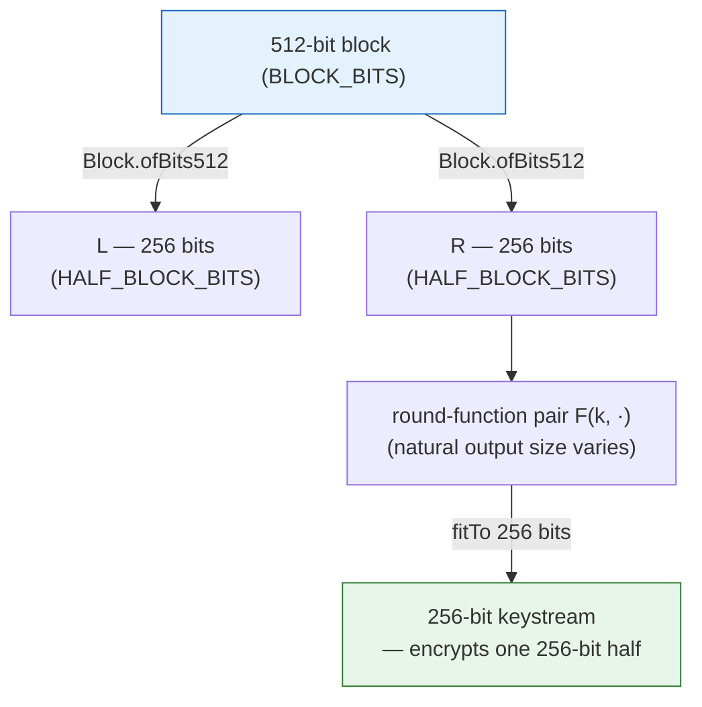
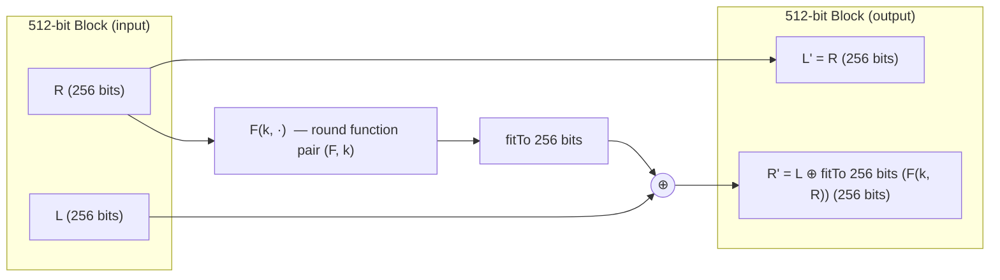
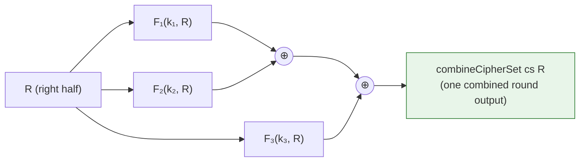
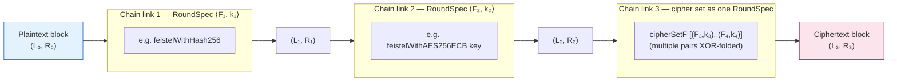
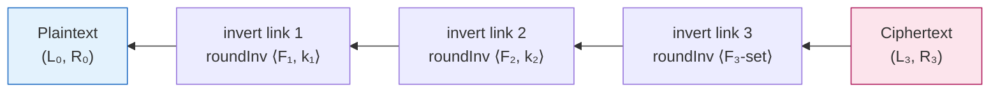

# Visualization: the dynamically generated Feistel cipher chain

This document visualizes how the generated block cipher works **as currently
implemented**, layer by layer:

0. the **512-bit block layout**: each block is 512 bits (64 bytes), split
   into two 256-bit halves, and every round-function pair encrypts exactly
   one 256-bit half per round (`BLOCK_BITS`/`HALF_BLOCK_BITS`/`fitTo`/
   `Block.ofBits512` in `Blackworm/Basic.lean`),
1. a single Feistel round (`feistelRound`/`feistelRoundIO` in
   `Blackworm/Basic.lean`, `round` in `Blackworm/FeistelTheory.lean`),
2. **multiple function pairs combined inside one round** — a *cipher set*
   (`CipherSet`/`combineCipherSet`/`cipherSetF` in
   `Blackworm/FeistelTheory.lean`),
3. the **chain**: a sequence of rounds/blocks where each link can use a
   completely different round function or cipher set
   (`feistelChainIO`/`feistelDechainIO` in `Blackworm/Basic.lean`,
   `RoundSpec`/`encryptChain`/`decryptChain` in
   `Blackworm/FeistelTheory.lean`), and
4. the **transpose** required for decryption
   (`decryptChain_eq_foldl_reverse`): the chain must be undone in reverse
   order.

> **Accuracy note.** The two halves of the design differ slightly, and the
> diagrams show this honestly:
>
> * In the *concrete* code (`Basic.lean`), each link is a `CipherPair` of
>   forward/inverse block functions. `CipherPair.ofFeistel` builds a pair
>   from a `ByteArray → IO ByteArray` function (e.g. `feistelWithHash256`,
>   `feistelWithAES256ECB key`, `feistelWithHKDF salt info len`). Keys are
>   captured inside these half-block closures.
> * In the *abstract* proof layer (`FeistelTheory.lean`), the pairs are
>   explicit: a `CipherSet` is a `List ((α → α → α) × α)` of
>   `(round function, round key)` pairs, several of which can be XOR-folded
>   into **one** round via `combineCipherSet`, and each chain link is a
>   `RoundSpec` pair `⟨F, k⟩`.
>
> So "multiple function pairs per round" is a proved capability of the
> abstract model (`MultiRound` section) which the concrete chain can realize
> by composing/mixing primitives inside one `ByteArray → IO ByteArray`
> closure. The concrete chain stores a `List CipherPair`: each pair has
> `forward` and `inverse` block transformations (`Block → IO Block`).
> `CipherPair.ofFeistel f` wraps a half-block function in a Feistel round
> and its inverse; this pair is distinct from the abstract `(F, k)` pair.

## 0. The 512-bit block: two 256-bit halves

A block is **512 bits** (`BLOCK_BITS`; 64 bytes, `BLOCK_SIZE`).
`Block.ofBits512` splits it into a 256-bit left half and a 256-bit right half
(`HALF_BLOCK_BITS`; 32 bytes each, `HALF_BLOCK_SIZE`); `Block.toBytes`
reassembles it. Each round-function pair encrypts exactly one 256-bit half per
round: a 256-bit SHA-256/SHA3-256 digest already matches the half exactly, and
for any other natural output size (a PKCS#7-padded AES ciphertext, an HKDF
output, ...) `fitTo` cycles or truncates it to 256 bits before it is XORed
into the other half, so the halves never grow or shrink.



## 1. A single Feistel round

`feistelRound b f = { left := b.right, right := b.left ⊕ fitTo 256 bits (f b.right) }`
(`⊕` is `xorByteArrays`; abstractly, any cancellative `xor`). Both halves are
256 bits, so each round-function pair encrypts a 256-bit block of the state.



Because only XOR and a swap touch the state, the round is invertible for
*any* round function `F` — even a non-invertible one like SHA-256
(`round_left_inv` / `round_right_inv`, mirrored concretely by
`feistelRoundInvIO`).

## 2. Multiple function pairs in one round: the cipher set

A `CipherSet` is a list of `(Fᵢ, kᵢ)` pairs. `combineCipherSet` applies every
pair to the *same* right half and XOR-folds the results; `cipherSetF`
collapses the whole set into one ordinary round function, so the round above
inherits invertibility for free.



Example: one round can mix SHA-256 **and** AES-256-ECB **and** an
HKDF-derived stream simultaneously — several primitives drawn from the pool
into the *same* round, not one primitive per round.

## 3. The chain: blocks/rounds linked together, each with its own cipher set

`feistelChainIO specs b` folds a 512-bit block through `specs` left-to-right,
applying each `CipherPair.forward`. For Feistel links, construct the pairs
with `CipherPair.ofFeistel`; each such link encrypts a 256-bit half.
Custom pairs may instead supply any size-preserving, mutually inverse
block transformations. Abstractly, `encryptChain` models the Feistel case
same over `List (RoundSpec α)`, where each `RoundSpec ⟨Fᵢ, kᵢ⟩` may itself be
a whole cipher set packaged via `RoundSpec.ofCipherSet`.



Each link in this diagram is a full Feistel round from §1; the links differ only in *which*
round function (or combined cipher set) they use — this is what makes the
chain "dynamically generated" (`deriveChain` in the theory file even derives
the whole spec list from a master key).

## 4. Decryption: the chain in transpose (reverse) order

The round applied **first** during encryption must be undone **last**.
`feistelDechainIO` therefore walks `specs.reverse`, applying
each pair's `inverse`. For `CipherPair.ofFeistel` links this calls
`feistelRoundInvIO`; `decryptChain_eq_foldl_reverse` proves the corresponding
abstract Feistel construction is exactly `decryptChain`, and
`decryptChain_encryptChain` proves its round trip is the identity. These
Feistel proofs do not establish correctness of arbitrary custom IO pairs;
their inverse relationship is the caller's responsibility.



```text
encrypt:  b ─[F₁]→ ─[F₂]→ ─[F₃]→ c        (specs, left to right)
decrypt:  c ─[F₃⁻¹]→ ─[F₂⁻¹]→ ─[F₁⁻¹]→ b  (specs.reverse — the transpose)
```

## Where each piece lives

| Concept in the diagrams | Concrete (`Blackworm/Basic.lean`) | Abstract proof (`Blackworm/FeistelTheory.lean`) |
| --- | --- | --- |
| 512-bit block, 256-bit halves | `BLOCK_BITS`/`BLOCK_SIZE`, `HALF_BLOCK_BITS`/`HALF_BLOCK_SIZE`, `Block.ofBits512`, `Block.toBytes`, `emptyHalf` | `HalfBlock := Bits 256`, `Block512 := Block HalfBlock` (§`Concrete`; `Block α` itself is size-agnostic) |
| Fitting a pair's output to one 256-bit half | `fitTo` | — (abstract `F` already maps `α → α`) |
| Block `(L, R)` | `Block` (`ByteArray` halves) | `Block α` |
| One round | `feistelRound`, `feistelRoundIO` | `round`, `round_left_inv`, `round_right_inv` |
| Round inverse | `feistelRoundInvIO` | `roundInv` |
| Multiple function pairs in one round | mix primitives inside one `ByteArray → IO ByteArray` closure | `CipherSet`, `combineCipherSet`, `cipherSetF` (§`MultiRound`) |
| Chain of heterogeneous rounds/blocks | `feistelChainIO` | `RoundSpec`, `encryptChain` (§`Chain`) |
| Reverse-order (transpose) decryption | `feistelDechainIO` (walks `specs.reverse`) | `decryptChain`, `decryptChain_eq_foldl_reverse` |
| End-to-end correctness | — | `decryptChain_encryptChain`, `feistelDecrypt_feistelEncrypt` |
