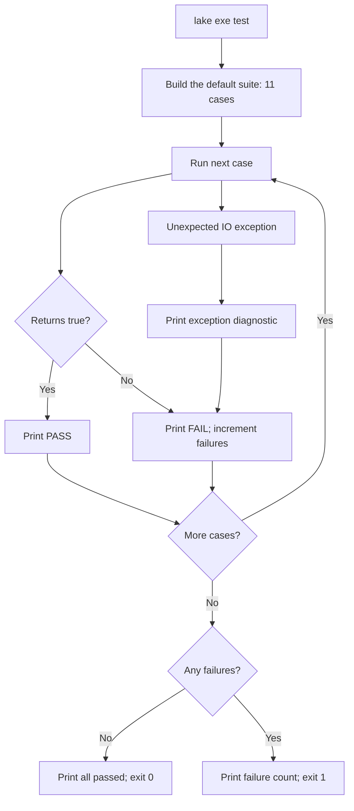
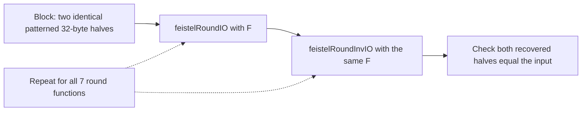
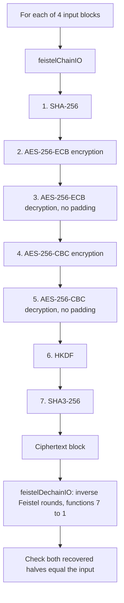
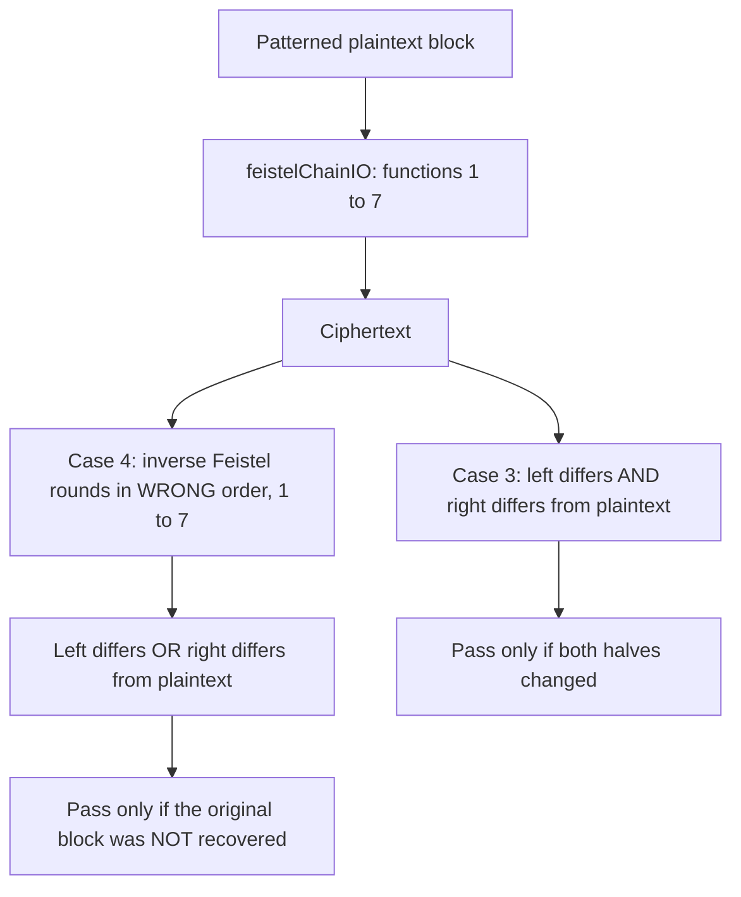
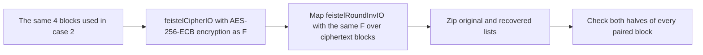
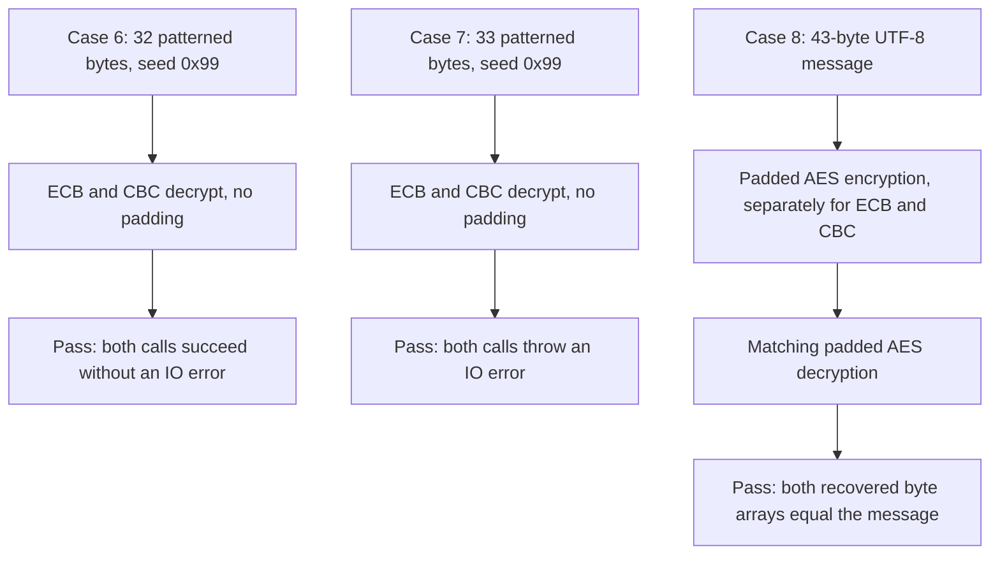

# Visualization: correctness tests

The suite executes eleven cases via `lake exe test`. Three cipher-pair
checks run first: empty-chain identity in both directions, custom block
transformations with distinct inverses (including exact invocation order
and both round-trip directions), and propagation of forward/inverse errors.
The diagrams below describe the remaining eight Feistel/crypto cases in
the order returned by [`defaultCases`](../Test/Suite.lean). They are a
coverage map, not live results. The [`runner`](../Test.lean) prints the
actual PASS/FAIL status.

## Execution and reporting

A failed case does not stop later cases. Each numbered case below produces
one status line, even when it checks multiple functions or inputs.

## 1. Single-round recovery with seven round functions

The seven functions are SHA-256, SHA3-256, AES-256-ECB encryption,
AES-256-CBC encryption, AES-256-ECB decryption without padding,
AES-256-CBC decryption without padding, and HKDF. All seven round trips
must pass. The inverse Feistel round reuses **the same F**, not an inverse
of the hash, HKDF, or AES operation.

## 2. Seven-link mixed-chain recovery

Each node below is a **Feistel round using the named function**, not a raw
primitive applied directly to the entire block.

The four blocks have all-zero halves, all-`0xFF` halves, patterned halves
with seeds `0x5A`/`0xA5`, and patterned halves with seeds `0x01`/`0x7E`.
Each half is 32 bytes. Every block must round-trip.

## 3 and 4. Guard against a no-op and incorrect inverse order

These are separate cases, each starting with a block whose two halves use
the `0x5A` pattern and independently encrypting it with the seven-link chain.

These assertions concern this specific test input; they do not prove that
every input changes or that wrong-order inversion can never match.

## 5. Multiple-block recovery

This exercises one Feistel round per block, not the seven-link mixed
chain. The implementation compares zipped pairs; it does not separately
assert the recovered list length.

## 6, 7 and 8. AES wrapper behavior

Case 6 uses arbitrary data, not previously generated ciphertext, and checks
success rather than output contents. Case 7 checks rejection of an input
whose length is not a multiple of the 16-byte AES block size; any IO error
satisfies the assertion. Case 8 uses
`The quick brown fox jumps over the lazy dog` to exercise genuine padded
AES round trips independently of Feistel inversion.

## Scope

All keys, IVs, salt, info, and block patterns are deterministic fixtures.
These are runtime correctness checks, not randomized tests, known-answer
cryptographic vectors, security proofs, or performance measurements.
See the [cipher diagrams](cipher-visualization.md) for the construction
and the [README](../README.md#formal-verification) for the separate Lean
proofs.
