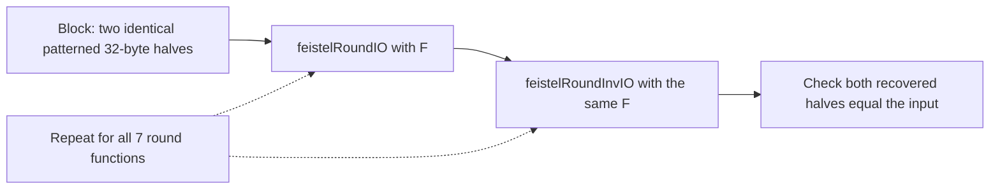
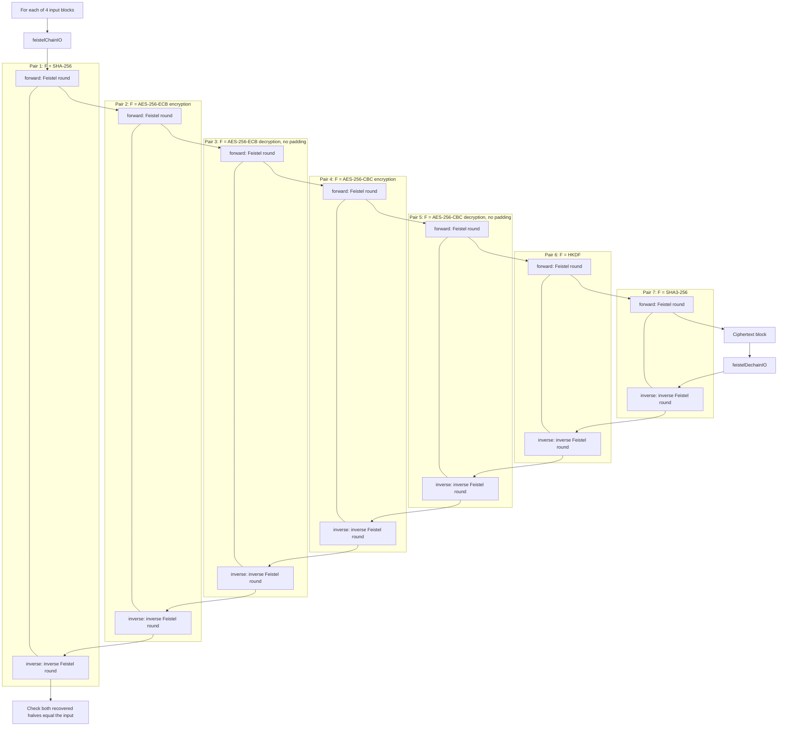
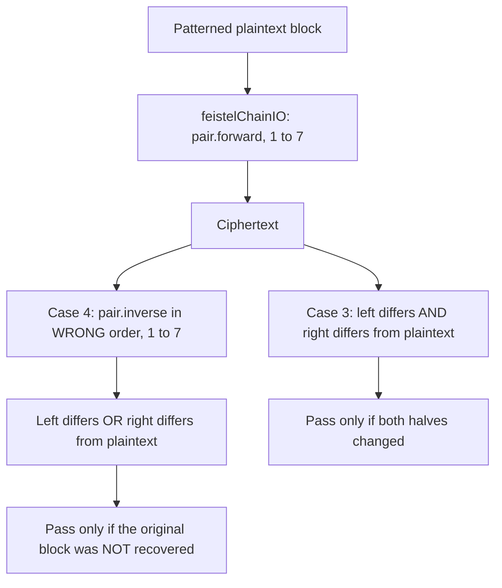
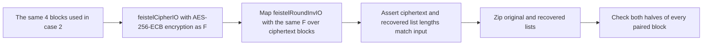
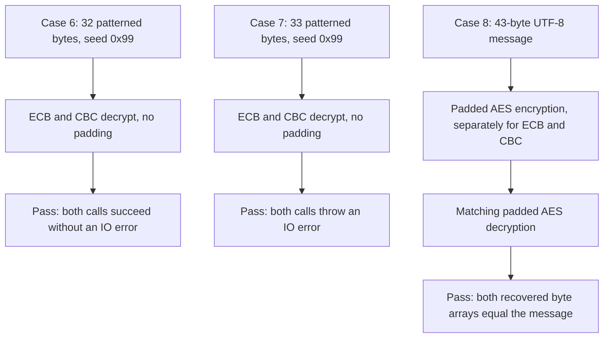

# Visualization: correctness tests

The suite executes seventeen cases via `lake exe test`. Three cipher-pair
checks run first: empty-chain identity in both directions, custom block
transformations with distinct inverses (including exact invocation order
and both round-trip directions), and propagation of forward/inverse errors.
Sections 1–8 below describe the next eight Feistel/crypto cases in
the order returned by [`defaultCases`](../Test/Suite.lean). They are a
coverage map, not live results. The [`runner`](../Test.lean) prints the
actual PASS/FAIL status. Six additional cases are described after section 8.

## Execution and reporting

A failed case does not stop later cases. Each case produces one status
line, even when it checks multiple functions or inputs. Section numbers
1–8 refer to the Feistel/crypto cases, not their positions in the full
seventeen-case runner output.

## Cipher-pair checks (run before sections 1–8)

| Runner position | Check | Assertions |
| --- | --- | --- |
| 1 | Empty chain | Both encryption and decryption return the input block unchanged. |
| 2 | Custom pairs | Pair 1 adds one to each left-half byte, with subtraction as its inverse; pair 2 swaps halves in both directions. Encryption matches the expected block, both round-trip directions recover the input, and the encrypt-then-decrypt call order is exactly `shift forward`, `swap forward`, `swap inverse`, `shift inverse`. |
| 3 | Error propagation | A failing pair throws an IO error in each direction; neither chain function suppresses it. The assertions accept any IO error, not a specific message. |

## 1. Single-round recovery with seven round functions

The seven functions are SHA-256, SHA3-256, AES-256-ECB encryption,
AES-256-CBC encryption, AES-256-ECB decryption without padding,
AES-256-CBC decryption without padding, and HKDF. All seven round trips
must pass. The inverse Feistel round reuses **the same F**, not an inverse
of the hash, HKDF, or AES operation.

## 2. Seven-link mixed-chain recovery

Each link is a `CipherPair.ofFeistel F`, containing **two block functions**:
`forward b = feistelRoundIO b F` and
`inverse b = feistelRoundInvIO b F`. Both reuse the same half-block
primitive `F`; the inverse member is not the inverse of that primitive.
Encryption follows the forward members from 1 to 7; decryption follows
the inverse members from 7 to 1.

The undirected lines group the two members of each pair; arrows show
execution order.

The four blocks have all-zero halves, all-`0xFF` halves, patterned halves
with seeds `0x5A`/`0xA5`, and patterned halves with seeds `0x01`/`0x7E`.
Each half is 32 bytes. Every block must round-trip.

## 3 and 4. Guard against a no-op and incorrect inverse order

These are separate cases, each starting with a block whose two halves use
the `0x5A` pattern and independently encrypting it with the seven-link chain.

These assertions concern this specific test input; they do not prove that
every input changes or that wrong-order inversion can never match.

## 5. Multiple-block recovery

This exercises one Feistel round per block, not the seven-link mixed
chain. Both output list lengths must match the input before zipped
comparisons can pass, guarding against dropped or duplicated blocks.

## 6, 7 and 8. AES wrapper behavior

Case 6 uses arbitrary data, not previously generated ciphertext, and checks
success rather than output contents. Case 7 checks rejection of an input
whose length is not a multiple of the 16-byte AES block size; any IO error
satisfies the assertion. Case 8 uses
`The quick brown fox jumps over the lazy dog` to exercise genuine padded
AES round trips independently of Feistel inversion.

## Additional regression coverage (runner positions 12–17)

| Position | Case | Assertions |
| --- | --- | --- |
| 12 | Generated chains | Sixteen deterministic nonlinear byte patterns, rotated primitive orders, and chain lengths 0–14 produce 240 cases; both round-trip directions recover the input. |
| 13 | Block validation | Invalid left/right lengths are rejected at entry, including empty chains. Size-changing custom forward/inverse members throw before a subsequent link runs. |
| 14 | Padded messages | Every message length 0–193 round-trips through both empty and mixed chains; ciphertext size is exactly `(size / 64 + 1) * 64`. An empty message produces a full block of padding bytes. |
| 15 | Invalid framing | Empty/non-aligned ciphertext, padding values 0 and above 64, and inconsistent trailing padding bytes throw IO errors. |
| 16 | Native errors | Empty padded AES ciphertext, raw no-padding misalignment, and raw PBKDF2 with zero iterations throw catchable IO errors. SHA-256's empty-input known answer still matches afterward. |
| 17 | AEAD semantics | AES-GCM and ChaCha20-Poly1305 recover valid plaintext, return `none` for a changed authentication tag, and throw for invalid tag setup. |

## Scope

All keys, IVs, salt, info, and block patterns are deterministic fixtures.
The generated cases are reproducible coverage, not randomized fuzzing or
exhaustive proofs. Apart from the single SHA-256 known answer, these are
round-trip/error tests rather than cryptographic vector suites. They do not
establish cryptographic security or measure performance.
See the [cipher diagrams](cipher-visualization.md) for the construction
and the [README](../README.md#formal-verification) for the separate Lean
proofs.
